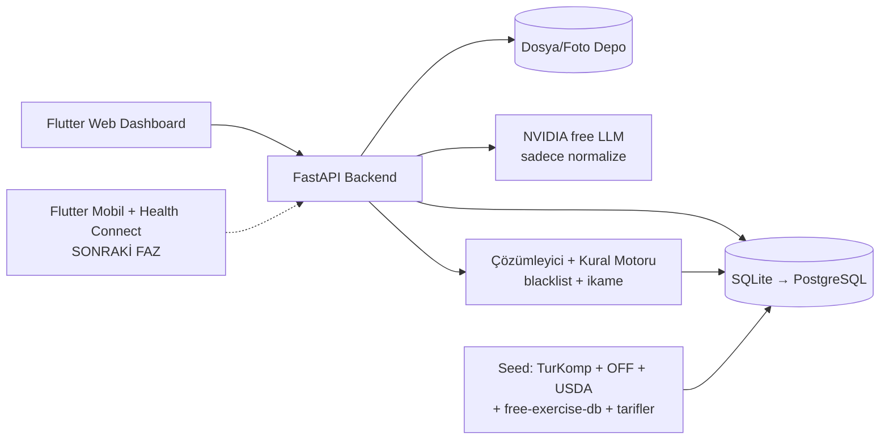

# Tasarım Dokümanı — Türkçe Beslenme & Fitness Koçu

> Durum: Taslak (v1, free-first MVP). Bu doküman uygulamanın mimarisini, veri modelini, dış kaynak seçimlerini ve yol haritasını tanımlar. Tüm teknik iddialar bağımsız olarak doğrulanmıştır; doğrulama tarihi: 2026-05.

## 1. Amaç ve Kapsam

Kişisel kullanım için (tek kullanıcı, ileride istenirse public) bir Türkçe beslenme ve fitness koçu uygulaması. Çekirdek yetenekler:

- **Doğal dilde yemek girişi:** "öğlen 1 kase kuru fasulye, 1 kase pilav, 1 ayran içtim" → öğelere ayrıştırma → kalori/makro çıkarımı.
- **Kara liste (blacklist):** istenmeyen malzemeleri içeren tarifler önerilmez; mümkünse malzeme çıkarma/ikame.
- **Türkçe ve bölgesel tarif önerisi:** yöresel malzemeleri bilen, "şu malzeme olmasın", "şununla ne pişer" deneyimi.
- **Aktivite + enerji dengesi:** adım/egzersiz verisiyle günlük net enerji; öğün ve antrenman önerisi.

Tasarım ilkesi: **ürünün rekabet avantajı API sayısı değil, kendi Türkçe veritabanı + normalizasyon + kural motorudur.** Dış API'ler veri besler; öneri/filtre mantığı bizde kalır.

## 2. Mimari (free-first, modüler monolit)

Mikroservis gereksiz; tek kullanıcı için **modüler monolit** hem ucuz hem hızlı, ileride servisleştirmeye uygun.



**Teknoloji yığını:**

| Katman | Seçim | Not |
|--------|-------|-----|
| Backend | FastAPI + Pydantic + SQLAlchemy (async) | API odaklı, otomatik OpenAPI |
| DB | SQLite (MVP) → PostgreSQL | Büyüyünce JSONB + pgvector |
| Cache | süreç-içi → Redis | Redis sonraya |
| İstemci | Flutter (web + mobil) | Önce web dashboard + backend |
| LLM | NVIDIA build.nvidia.com (nvapi-) | Yalnızca normalize; ~40 istek/dk free |

**Build sırası:** Backend + web dashboard **şimdi** (Windows'ta telefon/Mac/ücretli API olmadan çalışır). Mobil + Health Connect **sonra** (Android cihaz gerekir).

### 2.1 Sağlık verisi mimarisi (kritik)

Health Connect **cihaz-üstü bir Android API'sidir; bulut/sunucu REST endpoint'i yoktur.** Backend onu doğrudan çağıramaz. Gerçek akış:

`Android uygulaması (Health Connect SDK + izinler) → cihazda okur → backend'e HTTPS POST`

Backend pasif alıcıdır. Bu yüzden web istemcisi sağlık verisi kaynağı değil, **analiz/kontrol paneli**dir. iOS (HealthKit) aynı model + macOS/Xcode gerektirir → daha sonra.

> `PlannedExerciseSessionRecord` (üretilen programı cihaza geri yazma) **alpha** seviyededir (Jetpack 1.1.0-alpha12+), GA değil. MVP'de buna güvenilmez. Stabil okuma tipleri: `StepsRecord`, `ExerciseSessionRecord`, `ActiveCaloriesBurnedRecord`, `TotalCaloriesBurnedRecord`, `NutritionRecord`.

### 2.2 Doğal dil yemek akışı

`Türkçe cümle` → **LLM** (yalnızca `{isim, miktar, birim}` çıkarır) → **canonical ingredient resolver** (Türkçe alias normalizasyonu) → besin değeri **yapılandırılmış kaynaktan** (TurKomp/USDA/OFF) → düşük güvende kullanıcıya "bunu mu demek istedin?".

**Demir kural:** LLM sınıflandırır ve eşler; **kalori/makro değerini asla LLM üretmez** — her zaman DB'den gelir. LLM anahtarı yoksa kurallı (regex/sözlük) parser'a düşülür.

### 2.3 Malzeme çıkarma / blacklist (2 aşamalı)

1. **Hard filter:** blacklist'teki canonical malzeme tarifte varsa tarif elenir.
2. **Adaptation engine (kural motoru):** "çıkarılabilir mi / ikame mi / tarif bozulur mu?" (cacıkta sarımsak çıkar; beşamelde süt çıkmaz). **LLM yalnızca aday ikame önerir; son kararı kural motoru + canonical ilişkiler verir.**

## 3. Veri Katmanı (ürün omurgası)

İlke: **ham kaynak payload'ını (JSON) sakla + ayrıca normalize et.** Aynı malzemenin varyasyonları ("sumak / toz sumak / sumaq") tek `ingredient_canonical` kaydında toplanır; arama/öneri bunun üzerinden çalışır.

Çekirdek tablolar: `user_profile`, `user_goal`, `user_preference`, `ingredient_canonical`, `ingredient_alias_tr`, `ingredient_blacklist`, `nutrition_profile`, `food_product`, `recipe`, `recipe_ingredient`, `recipe_step_tr`, `recipe_tag`, `meal_log`, `meal_log_item`, `daily_health_summary`, `workout_template`, `workout_recommendation`, `recommendation`, `recommendation_feedback`, `source_attribution`, `import_job`.

Her tarif/besinde `source_attribution` + lisans modu tutulur (aşağı bkz. Lisans).

## 4. Dış Kaynaklar — Ücretsiz Öncelikli Matris

| Kaynak | Rol | Ücret | Lisans/Not |
|--------|-----|-------|------------|
| **TurKomp** (TÜBİTAK) | Türk besin kompozisyonu (simit, beyaz peynir, ayran…) | Ücretsiz | Toplu indirme yok, CC yok → **seçili çek, kaynak göster** |
| **Open Food Facts** | Barkod/paketli ürün | Ücretsiz | ODbL; okuma ~15/dk, User-Agent gerekir |
| **USDA FoodData Central** | Jenerik besin değeri | Ücretsiz | CC0; 1000 istek/saat/IP (ücretsiz key) |
| **`yuhonas/free-exercise-db`** | Egzersiz kataloğu (800+ hareket, görsel) | Ücretsiz | Public domain; auth yok, limit yok → **repoya gömülür** |
| **wger** | Egzersiz/rutin (opsiyonel) | Ücretsiz | AGPLv3; wger.de/api/v2/ sorgulanabilir |
| **NVIDIA build** | LLM normalize | Ücretsiz | ~40 istek/dk; nvapi- key |
| **NosyAPI** | Türkçe tarif (opsiyonel seed) | 50 kredi/ay free; $15/ay=2500 | **Seed stratejisi: 1 ay al → toplu çek → iptal** |
| **TheMealDB** | Tarif şema/demo | Ücretsiz | Çoğu İngilizce; sadece şablon |

**MVP'de gerekmeyenler (ertelendi):** Edamam (gerçek ücretsiz katman yok, sadece deneme), Spoonacular (yalnızca İngilizce), FatSecret NLP/görüntü (ücretli add-on), Foodvisor (self-serve API/fiyat yok), Nutritionix (satış-only, ~$1850/ay).

**Türkçe besin/tarif boşluğu:** Public, ücretsiz, self-serve bir Türkçe tarif API'si **yok** (NosyAPI hariç, o da kredili). Çözüm: **kendi yerel recipe DB + canonical ingredient ontolojisi**. Besin tarafında TurKomp Türk yemeği boşluğunu doldurur.

**Tahmini MVP API maliyeti: ~$0/ay.** (Public store: Google Play tek seferlik $25, Apple $99/yıl — sonra.)

## 5. Yol Haritası

| Faz | İçerik | Durum |
|-----|--------|-------|
| **0** | Monorepo, FastAPI skeleton, SQLite+Alembic, Docker, temel auth, bu doküman | **ŞİMDİ** |
| **1** | Besin omurgası: canonical ingredient, TurKomp/OFF/USDA adapter, doğal dil yemek kaydı, günlük özet | ŞİMDİ |
| **2** | Tarif zekası: yerel katalog + Türkçeleştirme, blacklist hard filter + ikame motoru, egzersiz kataloğu | ŞİMDİ |
| **3** | Öneri motoru v1 (kurallı, şeffaf): kalori bandı, enerji dengesi, öğün/antrenman önerisi | ŞİMDİ |
| **4** | Mobil + Health Connect (Android cihaz gerekir); sonra iOS/HealthKit (Mac) | SONRA |
| **5** | Opsiyonel: NosyAPI canlı, Edamam/FatSecret NLP+görüntü, fotoğraf tanıma, Redis/Celery, PostgreSQL+pgvector, public release | SONRA |

## 6. Git / Operasyon

**Trunk-based + kısa ömürlü feature branch + zorunlu PR.** `main` her zaman deploy edilebilir.

- Branch adları: `feat/…`, `fix/…`, `chore/…`, `docs/…`, `exp/…`.
- `main` protected: force-push kapalı, status checks zorunlu, linear history, squash merge.
- Sürüm: `v0.x` git tag.

Monorepo:
```
repo/
  apps/client_flutter/        # mobil + web (Faz 4)
  services/api/               # FastAPI backend
  services/worker/            # arka plan işleri (seed/normalize) — sonra
  packages/contracts/         # OpenAPI/DTO/canonical modeller
  packages/domain/            # iş kuralları (blacklist, ikame)
  infra/docker/  infra/ci/
  db/migrations/  db/seeds/
  docs/                       # DESIGN.md, ADR'ler, veri sözlüğü, lisans politikası
```

CI (GitHub Actions): Python lint+test (ruff + pytest), Alembic migration smoke test, OpenAPI diff, adapter contract testleri; sonra Flutter test/lint.

## 7. Riskler

- **Gizlilik:** sağlık/beslenme verisi hassas (GDPR md.9 benzeri). Açık rıza, silme/ihracat, minimum veri tutma, TLS, dinlenmede şifreleme. Public'e geçişte OAuth2/JWT.
- **Fotoğraftan kalori doğruluğu:** porsiyon tahmini güvenilmez → her zaman "tahmini değer + onayla/düzelt + favori öğün" akışı; AI sonucu nihai gerçek sayılmaz.
- **Tek kaynak yanılgısı:** OFF gönüllü veri (doğruluk garantisi yok) → çok-kaynaklı, confidence-aware tasarım.
- **Lisans:** Edamam cache kısıtı; TurKomp toplu indirme önerilmiyor + atıf; OFF ODbL; USDA CC0. `source_attribution` + `license_mode` her kayıtta.

## 8. Sorumluluk Reddi

Kalori/makro değerleri **yaklaşıktır**; öneriler **tıbbi/diyetisyen tavsiyesi değildir**. Aktivite önerileri genel güvenli sınırlar (örn. WHO: haftada 150 dk orta / 75 dk yüksek şiddet + 2 gün kuvvet) içinde tutulur.
